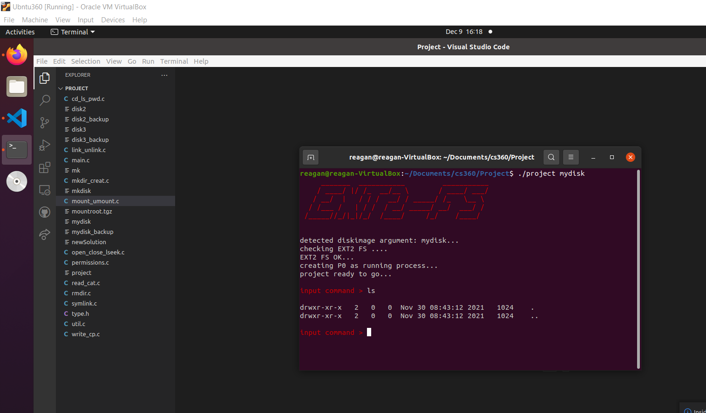

# Ex2 File-System Implementation

I implemented a fully functional ext2 file system coded in C. Using low-level programming, I used the tools provided by Linux kernel to create an ext2 file system from scratch. The application can create new partitions or mount and use an already existing ext2 structure and access the files within a device.

*This was a term project at Washington State University.*

